<!-- 
  ███╗   ███╗ ██████╗ ██╗  ██╗ █████╗ ███╗   ███╗███████╗██████╗ 
  ████╗ ████║██╔═══██╗██║  ██║██╔══██╗████╗ ████║██╔════╝██╔══██╗
  ██╔████╔██║██║   ██║███████║███████║██╔████╔██║█████╗  ██║  ██║
  ██║╚██╔╝██║██║   ██║██╔══██║██╔══██║██║╚██╔╝██║██╔══╝  ██║  ██║
  ██║ ╚═╝ ██║╚██████╔╝██║  ██║██║  ██║██║ ╚═╝ ██║███████╗██████╔╝
  ╚═╝     ╚═╝ ╚═════╝ ╚═╝  ╚═╝╚═╝  ╚═╝╚═╝     ╚═╝╚══════╝╚═════╝ 
-->

<div align="center">

<!-- HOLOGRAPHIC ANIMATED HEADER -->


<!-- MATRIX RAIN EFFECT BANNER -->


</div>

<!-- GLITCH TEXT EFFECT -->
<h1 align="center">
  
</h1>

<div align="center">

<!-- NEON GLOW BADGES -->
<a href="https://github.com/m7mdraafat"></a>
<a href="https://github.com/m7mdraafat"></a>
<a href="https://github.com/m7mdraafat"></a>

<br><br>

<!-- CYBERPUNK PROFILE CARD -->
```diff
@@                    ╔═══════════════════════════════════════════════════════╗                    @@
@@                    ║  > IDENTITY: Mohamed Raafat                           ║                    @@
@@                    ║  > ALIAS: m7mdraafat                                  ║                    @@
@@                    ║  > LOCATION: Egypt 🇪🇬                                 ║                    @@
@@                    ║  > STATUS: Online & Coding                            ║                    @@
@@                    ║  > MISSION: Building the Future with .NET             ║                    @@
@@                    ╚═══════════════════════════════════════════════════════╝                    @@
```

<!-- ANIMATED WAVE -->


</div>

---

<!-- INTERACTIVE TERMINAL SIMULATOR -->
<div align="center">

##  HACK THE MATRIX

```javascript
class MohamedRaafat extends Developer {
    constructor() {
        this.name = "Mohamed Raafat";
        this.title = "Software Engineer Intern @ Microsoft";
        this.location = "Egypt 🇪🇬";
        this.education = "CS @ Tanta University";
        this.currentlyLearning = ["Cloud Architecture", "System Design", "Microservices"];
        this.funFact = "I can debug code in my dreams! 💭";
    }

    get skills() {
        return {
            languages: ["C", "C++", "C#", "JavaScript", "SQL"],
            backend: ["ASP.NET Core", "Entity Framework", "LINQ", "REST APIs"],
            databases: ["SQL Server", "PostgreSQL"],
            architecture: ["Clean Architecture", "SOLID", "Design Patterns"],
            tools: ["Git", "Docker", "Azure", "Visual Studio"],
        };
    }

    get dailyRoutine() {
        return [
            "☕ Coffee.drink()",
            "💻 Code.write()",
            "🐛 Bugs.crush()",
            "🔄 Repeat.infinitely()",
        ];
    }
}
```

</div>

---

<!-- SKILL PROGRESS BARS WITH NEON EFFECT -->
<div align="center">

##  POWER LEVELS


<br>

<!-- CUSTOM ANIMATED SKILL BARS -->
<table>
<tr>
<td width="50%">

```text
C#/.NET        ████████████████████░░   95%
SQL Server     ███████████████████░░░   90%
ASP.NET Core   ██████████████████░░░░   85%
Entity Framework ████████████████░░░░   80%
JavaScript     ██████████████░░░░░░░░   70%
System Design  █████████████░░░░░░░░░   65%
```

</td>
<td width="50%">

```text
🏆 Problem Solving    [■■■■■■■■■■] 100%
🎯 Clean Architecture [■■■■■■■■■░]  95%
⚡ Performance        [■■■■■■■■░░]  85%
🔒 Security          [■■■■■■■░░░]  75%
☁️ Cloud Services    [■■■■■■░░░░]  65%
🤖 AI/ML             [■■■■░░░░░░]  45%
```

</td>
</tr>
</table>

</div>

---

<!-- 3D HOLOGRAPHIC TECH STACK -->
<div align="center">

##  TECH ARSENAL


<br><br>

<!-- ANIMATED TECH CARDS -->
<table>
<tr>
<td align="center" width="25%">

<br><b>C#</b>
<br><sub>Primary Weapon</sub>
</td>
<td align="center" width="25%">

<br><b>REST APIs</b>
<br><sub>Communication</sub>
</td>
<td align="center" width="25%">

<br><b>GitHub</b>
<br><sub>Version Control</sub>
</td>
<td align="center" width="25%">

<br><b>Docker</b>
<br><sub>Containerization</sub>
</td>
</tr>
</table>

</div>

---

<!-- COMPETITIVE PROGRAMMING ARENA -->
<div align="center">

##  BATTLE ARENA

<table>
<tr>
<td align="center">

### ⚔️ Codeforces
<a href="https://codeforces.com/profile/mohamedraafat1">

</a>

</td>
<td align="center">

### 🎯 LeetCode
<a href="https://leetcode.com/u/mo_raafat/">

</a>

</td>
</tr>
</table>

```
╔══════════════════════════════════════════════════════════════════════════════╗
║  🏅 ACHIEVEMENTS UNLOCKED                                                    ║
╠══════════════════════════════════════════════════════════════════════════════╣
║  [✓] Problem Solving Enthusiast    [✓] Algorithm Master                     ║
║  [✓] Data Structure Wizard         [✓] Competitive Programmer               ║
║  [✓] Daily Streak Warrior          [✓] Never Give Up                        ║
╚══════════════════════════════════════════════════════════════════════════════╝
```

</div>

---

<!-- GITHUB STATS WITH HOLOGRAPHIC EFFECT -->
<div align="center">

##  DAMAGE STATISTICS

<p>
  
  
</p>

<!-- ANIMATED CONTRIBUTION SNAKE -->
<picture>
  <source media="(prefers-color-scheme: dark)" srcset="https://raw.githubusercontent.com/m7mdraafat/m7mdraafat/output/github-contribution-grid-snake-dark.svg">
  <source media="(prefers-color-scheme: light)" srcset="https://raw.githubusercontent.com/m7mdraafat/m7mdraafat/output/github-contribution-grid-snake.svg">
  
</picture>

<!-- ACTIVITY GRAPH -->


</div>

---

<!-- 3D CONTRIBUTION SKYLINE -->
<div align="center">

##  3D WORLD

<a href="https://skyline.github.com/m7mdraafat/2025" title="2025 GitHub Skyline">
  
</a>

<!-- GITHUB SKYLINE ANIMATION -->
```
             ████                    █████████
           ████████                ████████████
         ██████████████          ████████████████
       ██████████████████      ████████████████████
      ████████████████████    ██████████████████████
    ████████████████████████████████████████████████████
   ██████████████████████████████████████████████████████
  ████████████████████████████████████████████████████████
  ████████████████████  MY GITHUB SKYLINE  ████████████████
```

</div>

---

<!-- TROPHIES WITH GLOW -->
<div align="center">

##  TROPHY CABINET


</div>

---

<!-- ADVANCED METRICS -->
<div align="center">

##  SYSTEM ANALYTICS

<table>
<tr>
<td>

</td>
<td>

</td>
</tr>
<tr>
<td>

</td>
<td>

</td>
</tr>
</table>

</div>

---

<!-- WAKATIME STATS -->
<div align="center">

##  TIME IN THE MATRIX

<!--START_SECTION:waka-->
```text
⌛ Time Zone: Africa/Cairo (UTC+2)

💻 This Week's Coding Stats Loading...

> Install WakaTime to track your coding journey!
```
<!--END_SECTION:waka-->


</div>

---

<!-- SPOTIFY NOW PLAYING -->
<div align="center">

##  NOW PLAYING

[](https://open.spotify.com/user/m7mdraafat)

</div>

---

<!-- BLOG POSTS -->
<div align="center">

##  LATEST TRANSMISSIONS

<!-- BLOG-POST-LIST:START -->
📡 **Incoming transmission...** Stay tuned for tech articles!
- 🚀 [Follow me on Dev.to](https://dev.to/m7mdraafat)
- ✍️ [Read on Medium](https://medium.com/@m7mdraafat)
<!-- BLOG-POST-LIST:END -->

</div>

---

<!-- DAILY DEV QUOTE WITH GLITCH -->
<div align="center">

##  WISDOM FROM THE MATRIX


</div>

---

<!-- CONNECT SECTION WITH NEON BUTTONS -->
<div align="center">

##  ESTABLISH CONNECTION

<a href="https://linkedin.com/in/mohamed-raafat-701290252">
  
</a>
<a href="mailto:m7mdraafat2003@gmail.com">
  
</a>
<a href="https://github.com/m7mdraafat">
  
</a>
<a href="https://wa.me/201503755070">
  
</a>
<a href="https://facebook.com/profile.php?id=100084236323114">
  
</a>
<a href="https://drive.google.com/file/d/11H9zUuqhxE4o3uRx2HzO31IM9aPRFmQH/view">
  
</a>

<br><br>

<!-- VISITOR COUNTER WITH STYLE -->


<br>

```
╔═══════════════════════════════════════════════════════════════════════════════════════════════════════╗
║                                                                                                       ║
║   ██████╗ ██████╗ ███████╗███╗   ██╗    ████████╗ ██████╗     ██╗    ██╗ ██████╗  ██████╗ ██╗  ██╗   ║
║  ██╔═══██╗██╔══██╗██╔════╝████╗  ██║    ╚══██╔══╝██╔═══██╗    ██║    ██║██╔═══██╗██╔══██╗██║ ██╔╝   ║
║  ██║   ██║██████╔╝█████╗  ██╔██╗ ██║       ██║   ██║   ██║    ██║ █╗ ██║██║   ██║██████╔╝█████╔╝    ║
║  ██║   ██║██╔═══╝ ██╔══╝  ██║╚██╗██║       ██║   ██║   ██║    ██║███╗██║██║   ██║██╔══██╗██╔═██╗    ║
║  ╚██████╔╝██║     ███████╗██║ ╚████║       ██║   ╚██████╔╝    ╚███╔███╔╝╚██████╔╝██║  ██║██║  ██╗   ║
║   ╚═════╝ ╚═╝     ╚══════╝╚═╝  ╚═══╝       ╚═╝    ╚═════╝      ╚══╝╚══╝  ╚═════╝ ╚═╝  ╚═╝╚═╝  ╚═╝   ║
║                                                                                                       ║
║                           🚀 Looking for New Opportunities! 🚀                                        ║
║                                                                                                       ║
╚═══════════════════════════════════════════════════════════════════════════════════════════════════════╝
```

</div>

---

<!-- SUPPORT SECTION -->
<div align="center">

##  FUEL MY CODE

<a href="https://buymeacoffee.com/m7mdraafat">
  
</a>

</div>

---

<!-- ANIMATED FOOTER -->
<div align="center">


</div>

<!-- HIDDEN KONAMI CODE EASTER EGG -->
<!--
████████████████████████████████████████████████████████████████████
█                                                                  █
█  🎮 KONAMI CODE ACTIVATED: ↑↑↓↓←→←→BA                           █
█                                                                  █
█  You found the secret! Here's what drives me:                    █
█                                                                  █
█  > while(alive) {                                                █
█  >     eat();                                                    █
█  >     sleep();                                                  █
█  >     code();                                                   █
█  >     repeat();                                                 █
█  > }                                                             █
█                                                                  █
█  "The best error message is the one that never shows up."        █
█                                                                  █
█  Want to collaborate? Let's build something legendary! 🚀        █
█                                                                  █
████████████████████████████████████████████████████████████████████
-->

<!-- GITHUB ACTIVITY BADGE -->
<div align="center">


</div>
